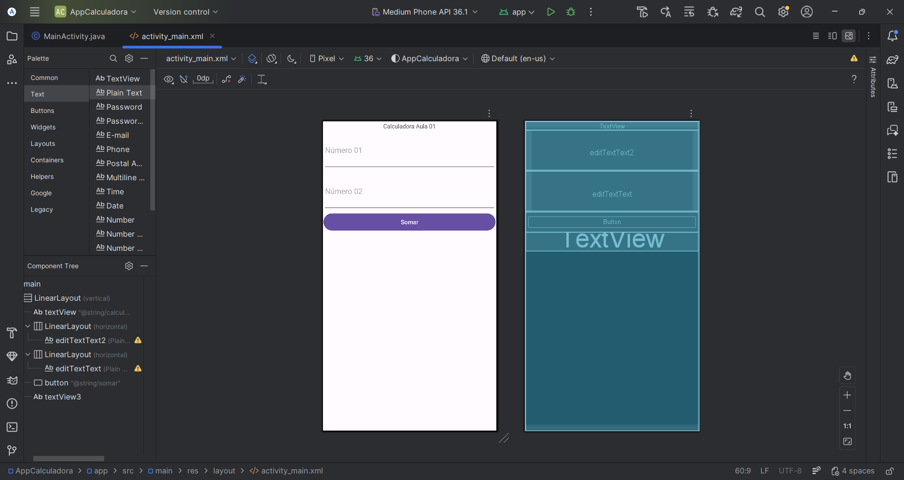

# 📱 Aula – Calculadora App

Aplicativo Android simples cujo objetivo é realizar a **soma de dois números informados pelo usuário**. 

A tela possui dois campos para digitação de números, um botão responsável por executar o cálculo e um campo de texto para apresentar o resultado.

---

## Estrutura da Activity

A classe `MainActivity` controla o comportamento da tela. Ela inicializa os componentes da interface, lê os valores digitados pelo usuário, realiza a operação matemática e atualiza o resultado exibido.

```java
public class MainActivity extends AppCompatActivity {

    EditText numero01;
    EditText numero02;
    TextView resultado;

    @Override
    protected void onCreate(Bundle savedInstanceState) {
        super.onCreate(savedInstanceState);

        setContentView(R.layout.activity_main);

        numero01 = findViewById(R.id.editTextText);
        numero02 = findViewById(R.id.editTextText2);
        resultado = findViewById(R.id.textView3);

        EdgeToEdge.enable(this);

        ViewCompat.setOnApplyWindowInsetsListener(findViewById(R.id.main), (v, insets) -> {
            Insets systemBars = insets.getInsets(WindowInsetsCompat.Type.systemBars());
            v.setPadding(systemBars.left, systemBars.top, systemBars.right, systemBars.bottom);
            return insets;
        });
    }

    public void calcular(View view){
        double n1 = Double.parseDouble(numero01.getText().toString());
        double n2 = Double.parseDouble(numero02.getText().toString());

        double soma = n1 + n2;

        resultado.setText(String.valueOf(soma));
    }
}
```

---

## Interface

View do aplicativo:



A interface utiliza três componentes principais:

**EditText**

Campo de entrada utilizado para que o usuário digite valores numéricos. O conteúdo digitado é armazenado como texto e posteriormente convertido para número dentro do código Java.

**TextView**

Elemento responsável por exibir informações na tela. Neste aplicativo ele mostra o resultado da operação realizada.

**Button**

Botão responsável por acionar o método `calcular()`. Quando pressionado, ele executa a lógica que lê os valores, realiza a soma e atualiza o `TextView`.

---

## Funcionamento

O usuário insere dois números nos campos `EditText`. Ao pressionar o botão de cálculo, o método `calcular()` é executado. Os valores digitados são convertidos para `double`, a soma é realizada e o resultado é exibido no componente `TextView`.

---

## UML

```plaintext
+----------------------+
|     MainActivity     |
+----------------------+
| - numero01 : EditText|
| - numero02 : EditText|
| - resultado : TextView|
+----------------------+
| + onCreate()         |
| + calcular(View)     |
+----------------------+
```

A classe `MainActivity` contém referências aos componentes da interface e métodos responsáveis pela inicialização da tela e execução da operação matemática.
