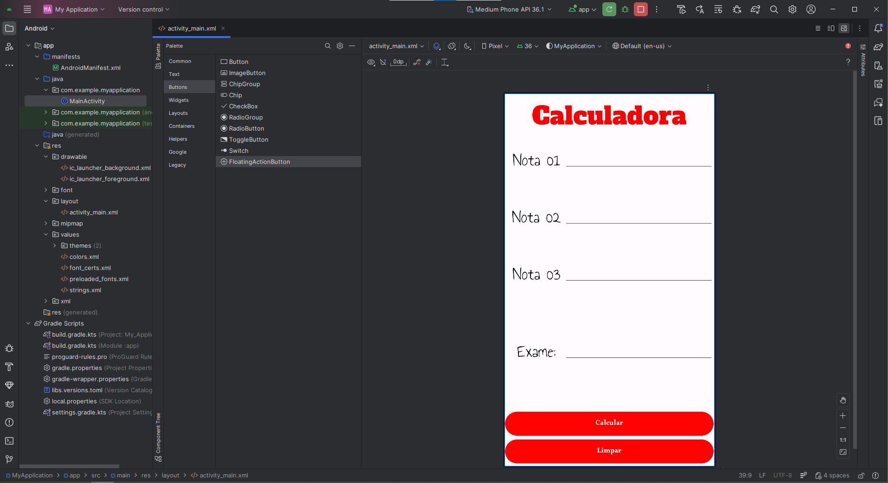
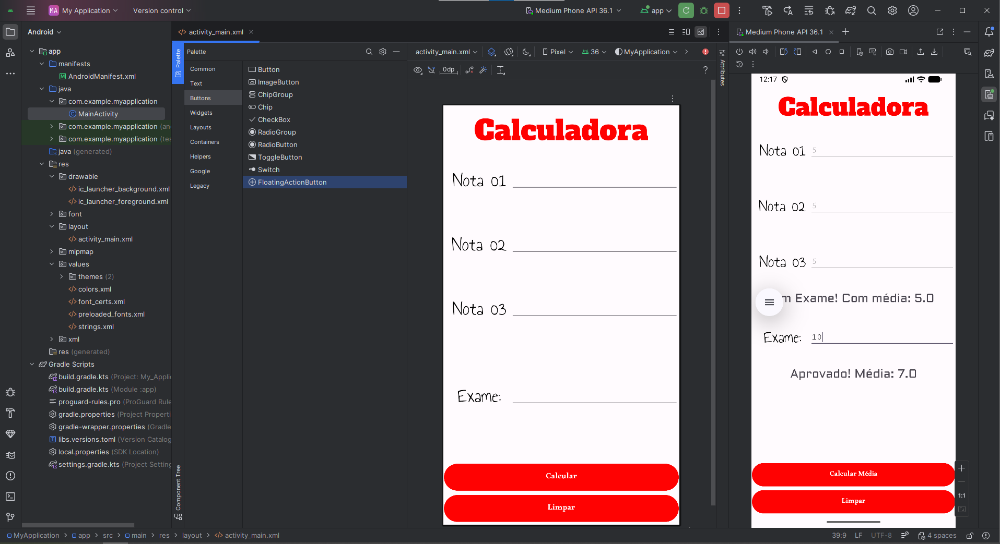

# 📊 Calculadora de Aprovação

Aplicativo Android desenvolvido em Java para calcular a média de um aluno e determinar sua situação final (**aprovado**, **exame** ou **reprovado**).

---

## 🖼️ Interface do App





---

## ⚙️ Funcionalidades

* ✅ Cálculo da média com 3 notas
* ⚠️ Validação de campos vazios
* 🔢 Restrição de notas entre **0 e 10**
* 📉 Resultado automático:

  * **Aprovado** (média ≥ 7)
  * **Exame** (média < 7)
* 📝 Cálculo da média final com exame:

  * Peso **60% média + 40% exame**
* 🔄 Função para limpar os campos

---

## 🧠 Lógica de Cálculo

**Média inicial:**

```
(nota1 + nota2 + nota3) / 3
```

**Média final (com exame):**

```
(media * 0.6) + (exame * 0.4)
```

---

## 💻 Código Principal

```java
// [...] imports

public class MainActivity extends AppCompatActivity {
    EditText nota1;
    EditText nota2;
    EditText nota3;
    EditText exameInput;

    TextView exame;
    TextView respostaProva;
    TextView respostaExame;

    Button botao;
    double media = 0;

    @Override
    protected void onCreate(Bundle savedInstanceState) {
        // [...] super

        exameInput = findViewById(R.id.exameInput);
        exame = findViewById(R.id.exame);
        respostaExame = findViewById(R.id.resultadoExame);

        nota1 = findViewById(R.id.nota1);
        nota2 = findViewById(R.id.nota2);
        nota3 = findViewById(R.id.nota3);

        respostaProva = findViewById(R.id.resultadoProva);
        botao = findViewById(R.id.button);

        exame.setVisibility(View.INVISIBLE);
        exameInput.setVisibility(View.INVISIBLE);
        respostaExame.setVisibility(View.INVISIBLE);
    }

    public void calcularNota(View view){
        if(this.nota1.getText().toString().isEmpty() ||
           this.nota2.getText().toString().isEmpty() ||
           this.nota3.getText().toString().isEmpty()){

            new AlertDialog.Builder(this)
                .setTitle("Aviso")
                .setMessage("Preencha todas as notas!")
                .setPositiveButton("OK", null)
                .show();
            return;
        }

        double nota1 = Double.parseDouble(this.nota1.getText().toString());
        double nota2 = Double.parseDouble(this.nota2.getText().toString());
        double nota3 = Double.parseDouble(this.nota3.getText().toString());

        if((nota1 > 10 || nota2 > 10 || nota3 > 10) ||
           (nota1 < 0 || nota2 < 0 || nota3 < 0)){

            new AlertDialog.Builder(this)
                .setTitle("Aviso")
                .setMessage("Nota de 0 a 10!")
                .setPositiveButton("OK", null)
                .show();
            return;
        }

        this.nota1.setEnabled(false);
        this.nota2.setEnabled(false);
        this.nota3.setEnabled(false);

        media = (nota1 + nota2 + nota3) / 3;

        if(media >= 7){
            respostaProva.setText(String.format("Aprovado!! Com média: %.1f", media));
        }else{
            respostaProva.setText(String.format("Em Exame! Com média: %.1f", media));

            exame.setVisibility(View.VISIBLE);
            exameInput.setVisibility(View.VISIBLE);
            respostaExame.setVisibility(View.VISIBLE);

            botao.setText("Calcular Média");
        }
    }

    private void calcularExame(View view){
        if(this.exameInput.getText().toString().isEmpty()){
            new AlertDialog.Builder(this)
                .setTitle("Aviso")
                .setMessage("Preencha o exame!")
                .setPositiveButton("OK", null)
                .show();
            return;
        }

        double exame = Double.parseDouble(this.exameInput.getText().toString());
        double mediaFinal = (media * 0.6) + (exame * 0.4);

        if(mediaFinal >= 5){
            respostaExame.setText(String.format("Aprovado! Média: %.1f", mediaFinal));
        }else{
            respostaExame.setText(String.format("Reprovado! Média: %.1f", mediaFinal));
        }
    }

    public void butao(View view){
        if(botao.getText().toString().equals("Calcular")){
            calcularNota(view);
        }else{
            calcularExame(view);
        }
    }

    public void limpar(View view){
        nota1.setText("");
        nota2.setText("");
        nota3.setText("");
        exameInput.setText("");

        this.nota1.setEnabled(true);
        this.nota2.setEnabled(true);
        this.nota3.setEnabled(true);

        exame.setVisibility(View.INVISIBLE);
        exameInput.setVisibility(View.INVISIBLE);
        respostaExame.setVisibility(View.INVISIBLE);

        botao.setText("Calcular");
        media = 0;
    }
}
```

---

## 📦 Download

👉 [Baixar APK](dist/Calculadora%20Aprovação.apk)
