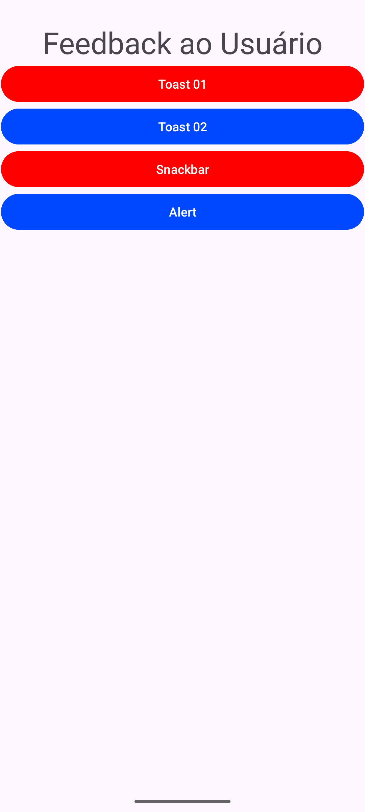

# Aula 01/07



---

## Códico Java

```java
public void toast01(View v){
        Toast.makeText(
                this,
                "Cadastro concluído!",
                Toast.LENGTH_LONG)
                .show();
    }

    public void toast02(View v) {
        Toast t = Toast.makeText(
                this,
                "Cadastro com sucesso",
                Toast.LENGTH_LONG);
        t.setGravity(Gravity.TOP, 0, 0);
        t.show();
    }

    public void snack(View v){
        Snackbar.make(findViewById(android.R.id.content),
                "Removido",
                Snackbar.LENGTH_LONG).setAction(
                        "Desfazer", va-> {
                            Toast.makeText(this,
                                    "Desfeito",
                                    Toast.LENGTH_LONG).show();

                        }
        ).show();
    }

    public void alert(View v){
        new AlertDialog.Builder(this)
                .setTitle("Excluir aluno")
                .setMessage("Deseja realmente excluir este aluno?")
                .setPositiveButton("Sim", (dialog, which) -> {
                    Toast.makeText(this,
                            "Aluno excluído!",
                            Toast.LENGTH_LONG).show();
                })
                .setNegativeButton("Não", (dialog, which) -> {
                    Toast.makeText(this,
                            "Exclusão cancelada.",
                            Toast.LENGTH_LONG).show();
                })
                .show();
    }
```
