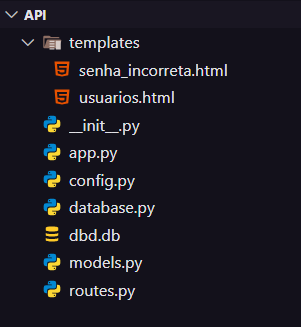

# Criação do Banco de Dados pro App + API

`Estrutura da API:` [*clique aqui*](../../API/)

---

### Página de Usuarios

> `127.0.0.1:500/usuarios/123` é uma url local.

> ## Utilização da API

> Após isso:

> "Por dentro":

