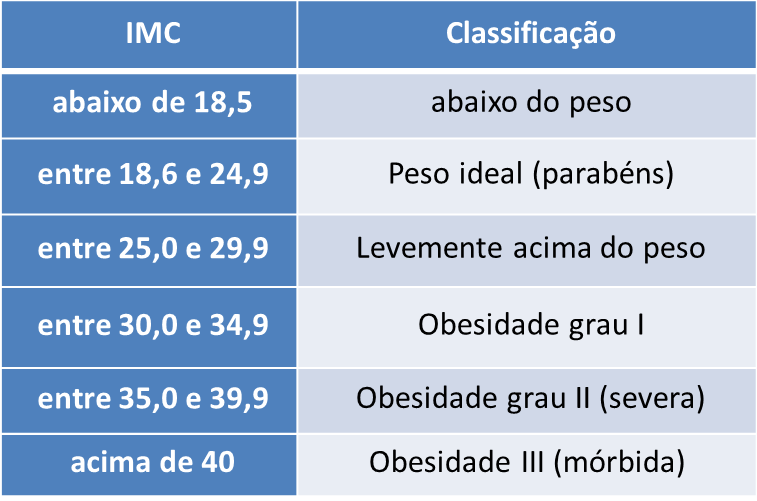

# Exercícios 16/03

## Testes condicionais

1. Faça um algoritmo que tenha duas variáveis que armazenam as horas trabalhadas por um funcionário e o valor recebido por hora, e em seguida, calcule quanto será o salário desse funcionário.

2. Faça um programa que armazena **3 números** e exiba o **maior deles**.

3. Elabore um algoritmo que tenha duas variáveis: **altura (h)** e **sexo** de um indivíduo e em seguida, calcule e mostre o **peso ideal**, conforme as fórmulas abaixo:

   - Para homens: `(72.7 * h) - 58`
   - Para mulheres: `(62.1 * h) - 44.7`

4. Faça um algoritmo que avalia o conteúdo de três variáveis do tipo inteiro (**dia, mês e ano**), e em seguida escreve a **data por extenso**.

   **Exemplo:**  
   `dia=10, mês=3, ano=2025 → 10 de março de 2025`

5. Faça um algoritmo que tenha **3 variáveis que representam 3 notas** e calcule a **média aritmética**.

   O algoritmo **não deve considerar notas inválidas** (valores negativos ou maiores que 10).

   **Exemplos:**

   - `7.5, 8, 8.5 → média = 8`
   - `8.5, 9.5, 11 → média = 9`

6. Elabore um algoritmo que lê duas informações: **peso e altura** de um indivíduo e calcule o **Índice de Massa Corporal (IMC)**, apresentando o resultado na tela.

   **Exemplo:**  
   `Seu IMC é 22,3 sendo considerado normal`

   **Fórmula do IMC:**

```

IMC = peso / (altura²)

```



1. Chico tem **0,8 m** e cresce **6 centímetros por ano**, enquanto Juca tem **0,60 m** e cresce **9 centímetros por ano**.

Construa um algoritmo que calcule e imprima **quantos anos serão necessários para que Juca seja maior que Chico**.

1. Faça um programa que escreva os **X primeiros números primos encontrados**.

**Exemplo:**  
Se `X = 15`, o algoritmo deverá escrever **os 15 primeiros números primos**.
