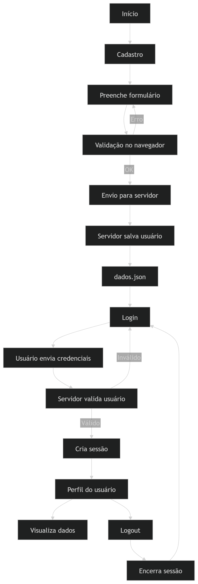

# Projeto — Cadastro, Login e Perfil (PHP)

## 📌 Visão geral

Sistema simples de **cadastro, login e perfil de usuário**, utilizando PHP, HTML, JS e armazenamento em JSON como “mini banco de dados”.

---

## ⚙️ Funcionalidades

### 🧾 Cadastro

- Formulário de registro de usuário
- Validação de dados (cliente e servidor)
- Senha armazenada com hash
- Dados salvos em `dados.json`

### 🔐 Login

- Autenticação via email e senha
- Verificação com `password_verify`
- Criação de sessão (`$_SESSION`)

### 👤 Perfil

- Exibe dados do usuário logado
- Acesso protegido por sessão
- Logout disponível

### 🚪 Logout

- Encerra sessão
- Redireciona para login

---

## 💾 Persistência

- Arquivo: `dados.json`
- Estrutura: lista de usuários em JSON
- Atua como banco de dados local

---

## 🔄 Fluxo principal

---

## 🧠 Conceitos usados

- PHP (form handling + sessão)
- JavaScript (validação simples)
- JSON (persistência)
- Password hashing
- Controle de sessão

---

## 🎯 Objetivo

Treinar o fluxo completo de autenticação web:
**cadastro → armazenamento → login → sessão → acesso protegido**

---

